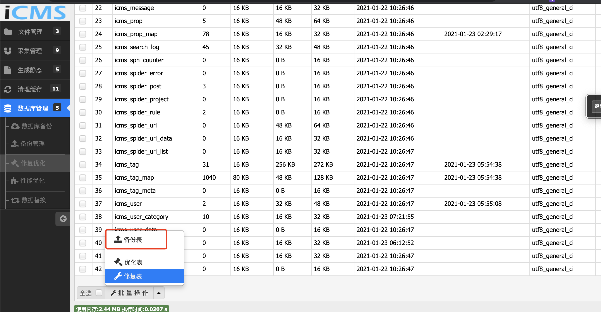
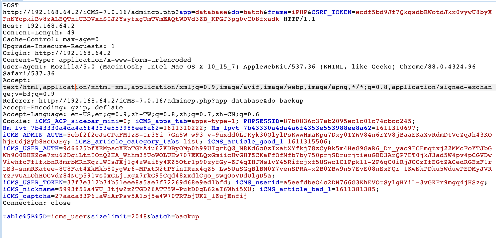
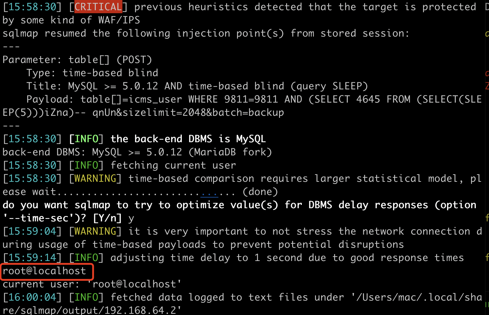
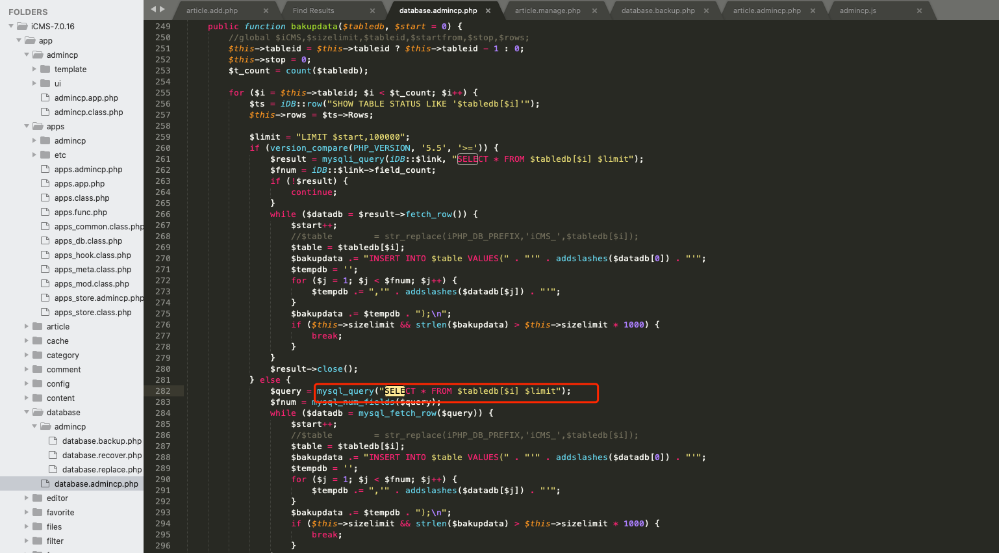

## Time Based SQL Injection in iCMS v7.0.16

There is a time based SQL Injection vulnerability happend in "databases manager-backup tables" in iCMS v7.0.16

### location

In the "databases manager-backup tables"

 
### proof

The "table" parameter in admincp.php of iCMS v7.0.16 allows  time based SQL Injection which enables attackers to retrieve all databases.

The reason is that the input parameters and SQL statements are spliced in the background:

